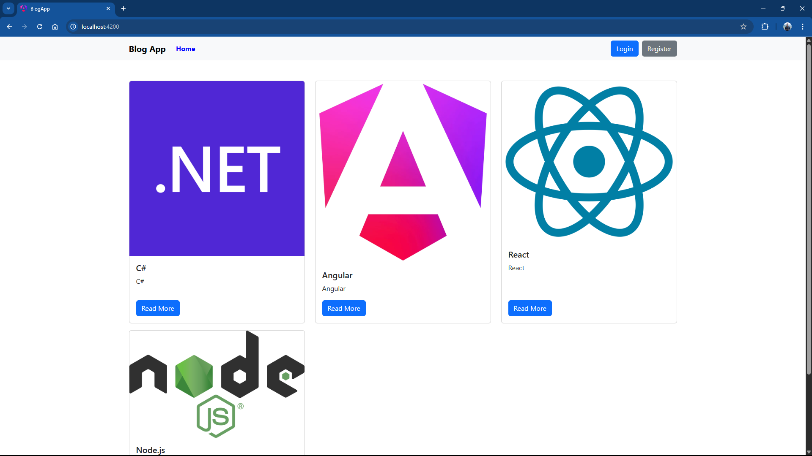
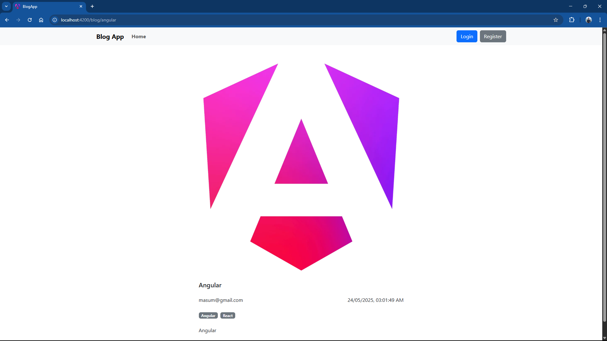
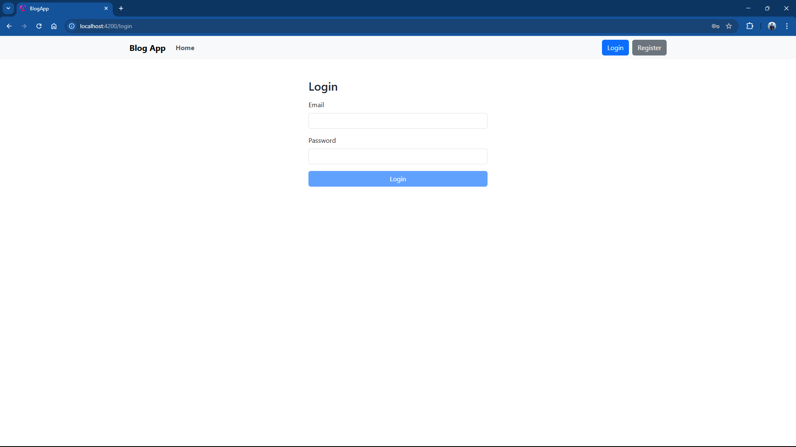
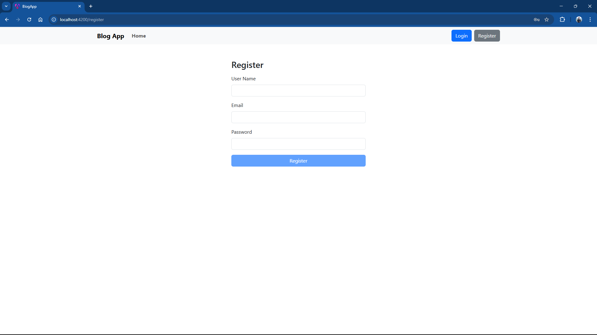
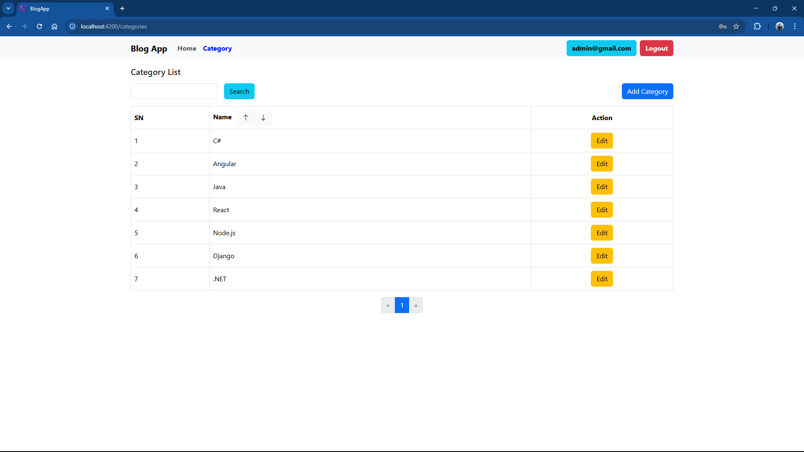
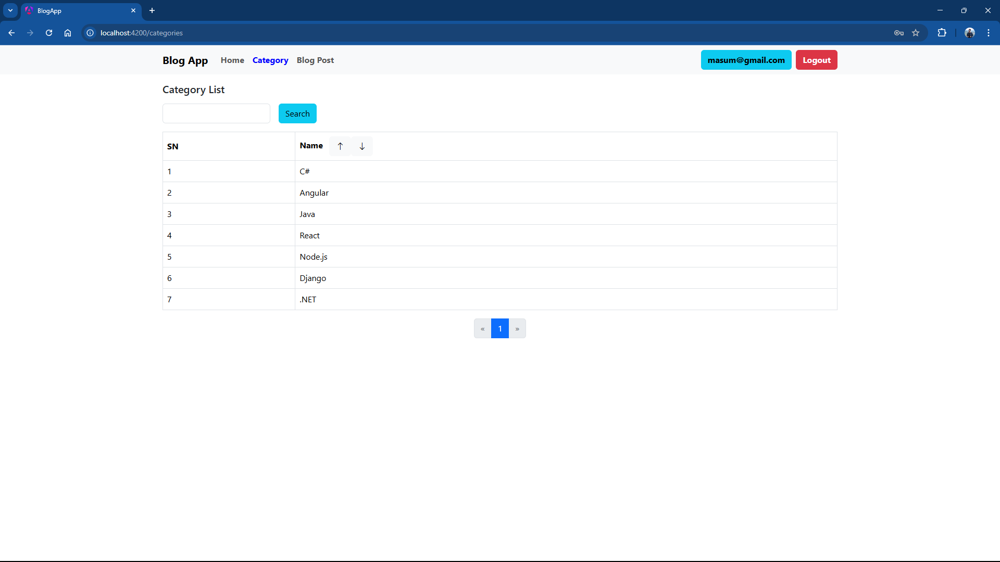
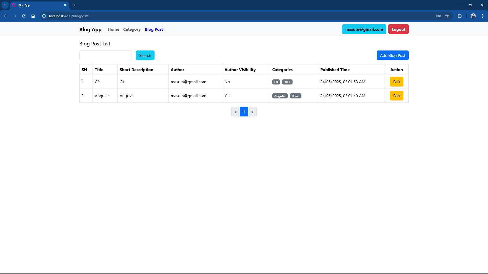

# Blog App

A web application to write and manage blogs. The backend was built using C# ASP.NET Web API, following a monolithic architecture with repository pattern to ensure maintainability and scalability. Utilized Entity Framework Core for data persistence and retrieval from a PostgreSQL database. Integrated ASP.NET Identity for authentication and role based authorization using JSON Web Token (JWT). Implemented image upload functionality to enhance blog content. In the frontend Angular was used for leveraging reusable components, services, guards, and interceptors. The responsive user interface was designed using Bootstrap.


## Frontend Project

[blog-app](https://github.com/pranto1209/blog-app)

## Backend Project

[BlogApp](https://github.com/pranto1209/BlogApp)


## Screenshots
















## Development server

To start a local development server, run:

```bash
ng serve
```


## Building

To build the project run:

```bash
ng build
```
