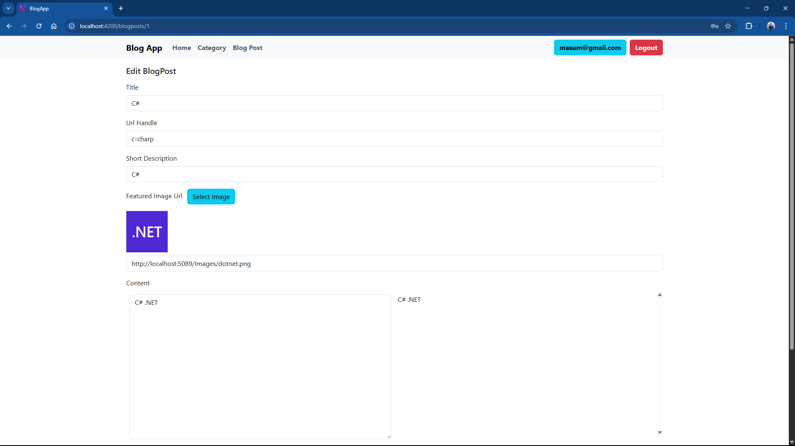

# Blog App

A full stack web application that allows users to write and manage blogs. Used C# ASP.NET Web API for backend and Angular for frontend. Monolith architecture with Repository pattern used for maintainable and scalable code. Entity Framework Core used for PostgreSQL database operations. Integrated ASP.NET Identity for authentication and role based authorization using JSON Web Token (JWT). Implemented Image upload features. Created reusable angular components, services, guards, interceptors. Implemented UI using bootsrap CSS.


## Frontend Project

[blog-app](https://github.com/pranto1209/blog-app)

## Backend Project

[BlogApp](https://github.com/pranto1209/BlogApp)


## Screenshots





## Development server

To start a local development server, run:

```bash
ng serve
```


## Building

To build the project run:

```bash
ng build
```
